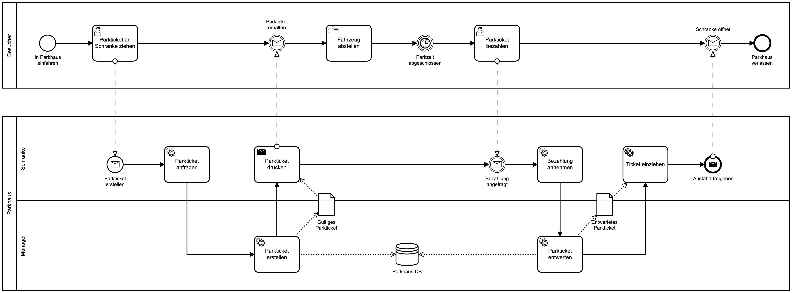

# Java Cloud Parkhaus

## Example

## Implementations

### Spring

[Getting started](./parkhaus-spring/README.md)

| Components                                            | Port |
| ----------------------------------------------------- |-----:|
| [Spring Manager](./parkhaus-spring/parkhaus-manager)  | 8080 |
| [Spring Schranke](./parkhaus-spring/parkhaus-schranke)| 8081 | 

### Quarkus

[Getting started](./parkhaus-quarkus/README.md)

| Components                                              | Port |
| --------------------------------------------------------|-----:|
| [Quarkus Manager](./parkhaus-quarkus/parkhaus-manager)  | 8180 |
| [Quarkus Schranke](./parkhaus-quarkus/parkhaus-schranke)| 8181 |

### Micronaut

[Getting started](./parkhaus-micronaut/README.md)

| Components                                                  | Port |
| ------------------------------------------------------------|-----:|
| [Micronaut Manager](./parkhaus-micronaut/parkhaus-manager)  | 8280 |
| [Micronaut Schranke](./parkhaus-micronaut/parkhaus-schranke)| 8181 |
